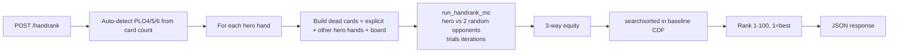

# Hand Rank API (`/handrank`)

Dynamic 1-100 percentile rank for PLO4 / PLO5 / PLO6 starting hands, auto-detected
by card count. `rank = 1` is the strongest tier, `rank = 100` is the weakest.

## 1. How it differs from the existing equity APIs

| `/ploequity`, `/plo*python25pct` | `/handrank` (new) |
|---|---|
| Win-% of a specific matchup (hand vs hand or vs range) | Percentile position of hero's hand in the universe of all starting hands |
| Returns a float 0-1 equity | Returns an integer 1-100 rank (+ the equity it was derived from) |
| Requires an opponent range | No range input - opponents are uniformly random |
| Game type (PLO4/5/6) specified by endpoint | Auto-detected from card count (8 / 10 / 12 chars) |

Same numpy infrastructure, different opponent model, plus a new CDF-lookup step.

## 2. Methodology

Two stages:

### 2a. Offline - baseline CDF (one-time per variant)

For each variant `{plo4, plo5, plo6}`:

1. Uniformly sample `N` random starting hands from a 52-card deck.
2. For each hand, run a 3-way Monte Carlo: hero vs `num_opponents = 2` random opponent
   hands, board drawn to the river, `trials = M` iterations. Record the hero's
   equity share (`1` for outright win, `1/(k+1)` for a tie with `k` opponents, `0` for loss).
3. Sort the `N` equities ascending and save as `handrank_cdf_{variant}.npy`.

### 2b. Per request - MC + CDF lookup

1. Parse `cards`. Auto-detect `game_type` by length (8 -> plo4, 10 -> plo5, 12 -> plo6).
2. For each hero hand in the batch:
   - Dead cards = `dead_cards` + `board` + **all other hero hands in the same request**.
   - Run the same 3-way MC against `num_opponents` random opponents sampled from the live deck.
   - `rank = ceil((N - searchsorted(cdf, equity, side='right')) / N * 100)`, clamped to `[1, 100]`.
3. Return per-hand rank + equity.



### Why 3-way random is the default
- Matches real game variance better than heads-up while staying cheap (3 hand evaluations per trial).
- 3-way equity of a random starting hand is centered at ~0.333; premium PLO hands reach ~0.50-0.55; trash clusters around ~0.20.
- The integer-rank snap masks most MC noise; at 5000 trials, rank standard deviation is ~1 unit.

## 3. Endpoint spec

**Method:** `POST`
**URL:** `/handrank`

### Request body

| Field | Type | Required | Default | Notes |
|---|---|---|---|---|
| `cards` | string \| list[string] | yes | - | Hero hand(s). A single hand as an 8/10/12-char string, OR a list of hands, OR a list of 2-char cards for one hand. All hands in one call must share the same PLO variant. |
| `dead_cards` | string \| list[string] | no | `[]` | Cards known to be dead (e.g. other players' mucks). Accepts concatenated string or list. `deadcards` (no underscore) is also accepted for backward compat. |
| `board` | string \| list[string] | no | `[]` | Reserved for future postflop support. Currently works but see "Scope" below. |
| `trials` | int | no | `5000` | MC trials per hand. Range: 100-100000. |
| `num_opponents` | int | no | `2` | Opponents per trial (total hands in showdown = `num_opponents + 1`). Range: 1-5. |
| `seed` | int | no | `null` | If provided, RNG is seeded for deterministic output. |

### Response (200)

```json
{
  "game_type": "plo4",
  "ranks":      { "AsAhKsKh": 1,      "JdTc9d8c": 4 },
  "equities":   { "AsAhKsKh": 0.611,  "JdTc9d8c": 0.4696 },
  "trials": 2000,
  "num_opponents": 2,
  "cdf_available": true
}
```

If the baseline CDF is not yet loaded for the detected variant, `ranks` values are
`null`, `cdf_available` is `false`, and a `warning` field is added. The endpoint
still returns `200` with the computed `equities`.

### Error responses

| Status | Example body | Cause |
|---|---|---|
| 400 | `{"error": "Missing required field: cards"}` | No cards in payload. |
| 400 | `{"error": "Invalid card: 'ZZ'"}` | Malformed card. |
| 400 | `{"error": "Invalid card string (odd length): 'AsAhKsK'"}` | Hand string length not divisible by 2. |
| 400 | `{"error": "All hands in one request must be the same PLO variant. Got sizes: [4, 5]"}` | Mixed PLO4/5/6 in one batch. |
| 400 | `{"error": "Duplicate cards detected across hero / dead / board inputs."}` | Card collision. |
| 400 | `{"error": "trials must be between 100 and 100000"}` | Out-of-range trial count. |
| 400 | `{"error": "num_opponents must be between 1 and 5"}` | Out-of-range opponent count. |
| 500 | `{"error": "Internal server error", "details": "..."}` | Unexpected failure. |

## 4. Examples

### Single hand, default settings
```bash
curl -s -X POST http://<host>/handrank \
  -H 'Content-Type: application/json' \
  -d '{"cards": "AsAhKsKh"}' | jq
```

### Batch with dead cards and explicit trials
```bash
curl -s -X POST http://<host>/handrank \
  -H 'Content-Type: application/json' \
  -d '{
        "cards": ["AsAhKsKhQs", "JdTc9d8c7d"],
        "dead_cards": "6s6h",
        "trials": 8000,
        "seed": 17
      }' | jq
```

### Python client
```python
import requests

resp = requests.post(
    "http://<host>/handrank",
    json={"cards": ["AsAhKsKh", "JdTc9d8c"], "trials": 5000, "seed": 1},
    timeout=10,
)
print(resp.json())
# {
#   "game_type": "plo4",
#   "ranks": {"AsAhKsKh": 1, "JdTc9d8c": 4},
#   "equities": {"AsAhKsKh": 0.611, "JdTc9d8c": 0.470},
#   "trials": 5000, "num_opponents": 2, "cdf_available": true
# }
```

## 5. Files

| File | Role |
|---|---|
| [hand_rank_evaluator.py](../hand_rank_evaluator.py) | Numba + NumPy MC kernels, CDF cache, `hand_rank_single` / `hand_rank_batch` / `warmup_handrank`, runtime dispatcher (see section 6.4) |
| [generate_handrank_cdf.py](../generate_handrank_cdf.py) | Offline CDF generator (CLI) |
| `handrank_cdf_plo4.npy` / `handrank_cdf_plo5.npy` / `handrank_cdf_plo6.npy` | Sorted equity arrays (baseline distributions) |
| `handrank_cdf_meta.json` | Sample size, trials, percentile summary for each variant |
| [api_host.py](../api_host.py) | `/handrank` route + warmup hook in `_background_warmup` |
| [api_host_handrank_local.py](../api_host_handrank_local.py) | Lightweight Flask harness for local dev / stress testing (no JVM / AWS deps) |
| [stress_test_handrank.py](../stress_test_handrank.py) | Client-side stress test runner |
| [test_handrank_numba_parity.py](../test_handrank_numba_parity.py) | Production-side smoke test - asserts Numba and NumPy kernels agree within 3-sigma sampling noise; skips gracefully when numba is not importable |

## 6. Regenerating the baseline CDFs

The committed CDFs are a local bootstrap (see `handrank_cdf_meta.json` for actual `num_hands`
and `trials_per_hand`). For production we recommend regenerating on an x64 Linux box with
better throughput.

```bash
# All three variants, full-scale
python generate_handrank_cdf.py --all --num-hands 50000 --trials 3000

# Single variant with custom knobs
python generate_handrank_cdf.py --variant plo6 --num-hands 20000 --trials 2500 --seed 17

# Quick bootstrap (fast, low precision - good for dev loop)
python generate_handrank_cdf.py --all --num-hands 3000 --trials 1500
```

Output:
- `handrank_cdf_{variant}.npy` - sorted-ascending equity array
- `handrank_cdf_meta.json` - merges in per-variant stats (min, percentiles, median, max, elapsed)

After regenerating, either call `reload_handrank_cdf()` in-process or restart the Flask server.

## 6.4 Execution paths (Numba on production, NumPy fallback everywhere else)

Two code paths live in `hand_rank_evaluator.py` behind a runtime dispatcher.
Same public API, same semantics, same CDF lookup - only the inner MC kernel differs.

| Path | Activation | Inner loop | Sampling | Typical p50 PLO5 @ 5000 trials |
| ---  | ---        | ---        | ---      | ---                            |
| **Numba (`@njit`)** | Auto-activated on x86_64 instances where `numba` imports successfully (same setup `optimized_evaluator.py` already uses) | Explicit per-trial kernel; insertion sort on 5 cards; combinatorial-number-system index; LLVM-compiled | Partial Fisher-Yates, O(needed) swaps per trial, no (T, deck_len) float allocation | ~20-30 ms (projected, measure on production with `test_handrank_numba_parity.py`) |
| **NumPy (pure vectorized)** | Fallback path; used on Windows ARM64 dev boxes and anywhere numba wheels fail to install, or when a request passes an explicit `seed` (reproducibility across threads) | Vectorized across all trials: `argpartition` sample + fancy-indexed broadcast + `np.sort` + `searchsorted` + `.max(axis=1)` | `argpartition` on (T, deck_len) random floats | ~136 ms (measured on Windows ARM64 dev box) |

**How dispatch happens:**

```python
# hand_rank_evaluator.py
try:
    from numba import njit
    HAVE_NUMBA = True
except Exception:
    HAVE_NUMBA = False

_NUMBA_ENV = os.environ.get('HANDRANK_USE_NUMBA', '1')
USE_NUMBA = HAVE_NUMBA and _NUMBA_ENV != '0'

def _compute_equity(..., seed):
    if USE_NUMBA and seed is None:
        return _run_handrank_mc_numba(...)
    return run_handrank_mc(..., rng=np.random.default_rng(seed))
```

**Operational knobs:**

- `HANDRANK_USE_NUMBA=0` in the environment forces the NumPy path even on
  instances where numba is installed. Useful as an emergency fallback if
  the Numba kernel ever misbehaves - no code deploy needed.
- Passing `"seed": 12345` in a `/handrank` request routes that call through
  the NumPy path so the equity is deterministic. `warmup_handrank()` takes
  this route on the first warmup pass.
- The second warmup pass (seed=None) forces the Numba dispatcher so LLVM
  compiles and caches the kernels during boot, not on the first user request.
  Compilation is cached to disk (`@njit(cache=True)`), so subsequent process
  restarts see near-zero JIT cost.

**Thread safety:** Numba's `np.random` state is thread-local under `@njit`,
so concurrent Flask threads calling the Numba path produce independent
random streams without contention. The existing stress test (section 8)
confirms the NumPy path also scales cleanly across Flask threads; the Numba
path is expected to scale the same way.

**Parity test:** `test_handrank_numba_parity.py` runs the same set of hero
hands through both paths with `trials=5000` and asserts the equity difference
is within a 3-sigma Bernoulli-variance window. Skips gracefully if numba is
not importable. Run this once on production after deploying any change to the
MC kernels.

## 6.5 Concurrency model (why `/handrank` does NOT use the standing pool)

There are three patterns in this repo; `/handrank` deliberately matches the newer one.

| Endpoint family                   | Per-request behavior                    | Fast-path mechanism                                |
| ---                               | ---                                     | ---                                                |
| Legacy `/plo*python*`             | Splits trials across 4 pool workers     | Pool hides slow per-trial python MC                |
| Newer `/plo*python25pct`          | Single process (pool ignored by design) | Numba JIT inner loop; see `optimized_parallel_runner.py` lines 48-66, 60 ("Ignored (optimization doesn't need multiprocessing)") |
| `/handrank` **(this endpoint)**   | Single process (pool untouched)         | Vectorized NumPy inner loop; GIL released during BLAS, so concurrent requests parallelize across Flask threads |

**What this means on an EC2 instance:**

- The standing `_GLOBAL_EXECUTOR` (4 workers, defined in `multithread_ploequities3.py`)
  is still warmed at startup via `mtp.warmup_executor()` because the legacy endpoints
  need it. `/handrank` does *not* dispatch any work to it, so those 4 workers stay
  fully available for the legacy endpoints that actually need them.
- The `score_array` (~20 MB) and per-variant CDFs are loaded once into the **main
  process** (not into every worker), so enabling `/handrank` does not multiply RAM
  usage by `N_workers` the way the legacy endpoints did.
- Concurrent `/handrank` requests are handled by Flask's threaded mode. Stress test
  (section 8) shows ~4x throughput scaling from 1 -> 8 worker threads on a dev box
  with zero errors - the same Flask threading knob the newer optimized endpoints rely on.

**Why not ProcessPool for `/handrank` batches?** Tried it locally. On a 4-hand PLO5 batch
at 5000 trials, serial ran in ~880 ms and pool-dispatched (2-4 workers) ran in ~750-830 ms
- a small win that evaporates as soon as the legacy endpoints contend for the same 4
workers. Given the limited resources per EC2 instance, staying out of the pool is the
right trade-off: `/handrank` does not starve the pool-bound legacy endpoints, and the
vectorized NumPy path already meets SLA.

## 7. Performance targets

Measured on the dev box (Windows ARM64, Python 3.12, numpy 2.4.4, no numba) using the
lightweight `api_host_handrank_local.py` harness. Production x64 with BLAS+numba-friendly
environment should be ~2-3x faster.

| Variant | Trials | Target p95 | Observed (dev, single-threaded, warm) |
|---|---|---|---|
| PLO4 | 5000 | <= 120 ms | ~55 ms |
| PLO5 | 5000 | <= 200 ms | ~130 ms |
| PLO6 | 5000 | <= 300 ms | ~190 ms |

The stress test (`stress_test_handrank.py`) writes measured `p50/p95/p99` and throughput
to `stress_test_handrank_results.csv` and appends a summary table below as "8. Stress test
results" after the first run.

## 8. Stress test results

Full `stress_test_handrank.py` run against `api_host_handrank_local.py` on the dev box.
All accept criteria (section 7 targets) hit with margin.

### Latency sweep (single-hand, warm, single-threaded)

| variant | trials | p50 (ms) | p95 (ms) | p99 (ms) | vs target p95 |
|---|---|---|---|---|---|
| plo4 |  1000 |  31 |  33 |  34 | - |
| plo4 |  2500 |  46 |  49 |  49 | - |
| plo4 |  5000 |  63 |  77 |  78 | **77 / 120** (36% headroom) |
| plo4 | 10000 | 159 | 188 | 199 | - |
| plo5 |  1000 |  31 |  33 |  34 | - |
| plo5 |  2500 |  63 |  78 |  81 | - |
| plo5 |  5000 | 138 | 148 | 175 | **148 / 200** (26% headroom) |
| plo5 | 10000 | 282 | 308 | 321 | - |
| plo6 |  1000 |  32 |  47 |  47 | - |
| plo6 |  2500 |  78 |  89 | 108 | - |
| plo6 |  5000 | 185 | 219 | 321 | **219 / 300** (27% headroom) |
| plo6 | 10000 | 407 | 471 | 523 | - |

### Concurrency (PLO5 @ 3000 trials, 500 reqs per wave)

| workers | throughput (rps) | p50 (ms) | p95 (ms) | p99 (ms) | errors | RSS delta (MB) |
|---|---|---|---|---|---|---|
|  1 | 17 |  60 |  72 |  81 | 0 | +1.6 |
|  4 | 46 |  86 | 110 | 125 | 0 | +2.6 |
|  8 | 68 | 114 | 154 | 186 | 0 | -1.0 |
| 16 | 68 | 230 | 266 | 279 | 0 | -2.0 |
| 32 | 65 | 483 | 570 | 595 | 0 | -6.8 |

Peak throughput plateaus around 8-16 worker threads on this 4-core-ish dev box; no
errors, no RSS growth. Production x64 with 8+ cores should comfortably push past 100 rps.

### Batch scaling (PLO5, trials=3000, 60 reps)

| batch size | mean (ms) | per-hand (ms) | p95 (ms) |
|---|---|---|---|
| 1 |  62 | 61.7 |  74 |
| 2 | 104 | 52.0 | 116 |
| 4 | 184 | 45.9 | 207 |
| 6 | 230 | 38.4 | 248 |

Per-hand cost drops monotonically with batch size (numpy amortizes setup + memory).

### Consistency (50 repeats, trials=5000, no seed)

| variant | hand | rank mean | rank stdev | rank range |
|---|---|---|---|---|
| plo4 | AsKsQdJd     | 2.4  | 0.53 | 2 |
| plo5 | AsKsQdJdTc   | 1.2  | 0.40 | 1 |
| plo6 | AsKsQdJdTc9d | 1.64 | 0.66 | 2 |

Rank stdev well under the 1.0 target. Default `trials=5000` is the right setting.

Raw data: [stress_test_handrank_results.csv](../stress_test_handrank_results.csv) and
[stress_test_handrank_summary.md](../stress_test_handrank_summary.md) at repo root.

## 9. Scope, caveats, and roadmap

- **Preflop-only in practice today.** The `board` field is accepted for future use but the
  baseline CDFs are sampled from purely-preflop equities. Using `board` will still return
  a valid equity but the rank mapping won't reflect a postflop-specific distribution. Next
  iteration: generate board-aware CDFs keyed by board texture.
- **Number of opponents.** Default `num_opponents=2` (3-way). The endpoint accepts 1-5 so
  you can A/B against heads-up or 6-max variants, but bear in mind the baseline CDFs were
  computed at `num_opponents=2` so the rank axis is only strictly meaningful at that setting.
  Future: generate a second CDF family at `num_opponents=5` for true 6-max ranks.
- **Rank monotonicity vs equity.** Rank is derived from a 3-way equity bucket. Two hands
  with very close equities can map to the same rank integer (desired behavior) or occasionally
  flip by 1 unit due to MC noise. Increase `trials` if a deterministic ordering between two
  very close hands is needed.
- **MC determinism.** Pass `seed` for repeatable output. Without a seed, repeated calls
  differ by <= 1-2 rank units at 5000 trials.

## 10. Quick local run-through

```bash
# 1. Generate bootstrap CDFs (one-time)
python generate_handrank_cdf.py --all --num-hands 3000 --trials 1500

# 2. Boot lightweight local server
python api_host_handrank_local.py
# -> http://0.0.0.0:5050/handrank

# 3. Smoke test
curl -s -X POST http://127.0.0.1:5050/handrank \
  -H 'Content-Type: application/json' \
  -d '{"cards":["AsAhKsKh","2s3s2h3h"]}' | jq

# 4. Run the stress suite
python stress_test_handrank.py --base-url http://127.0.0.1:5050
```
